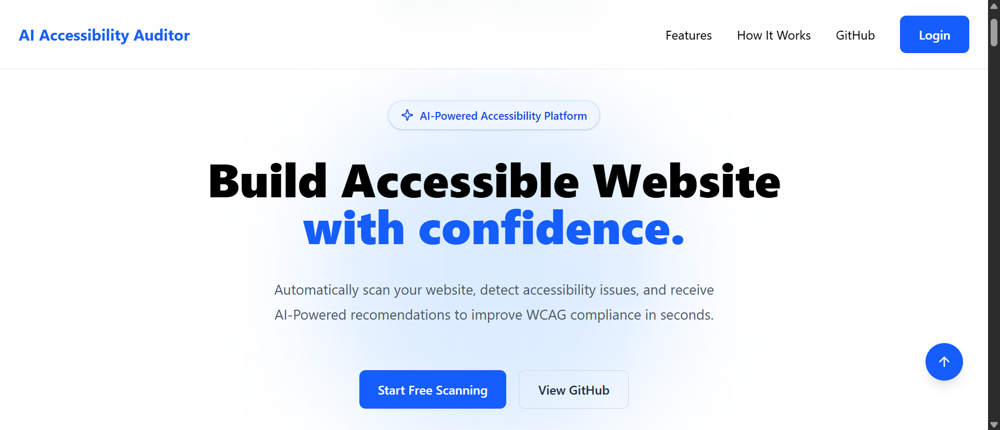
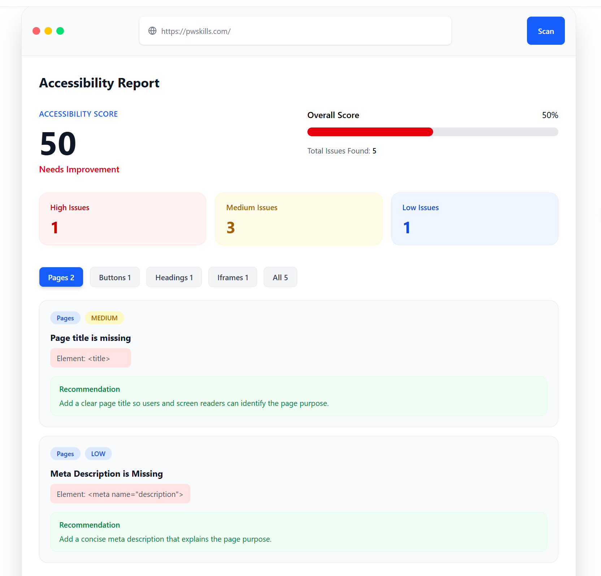
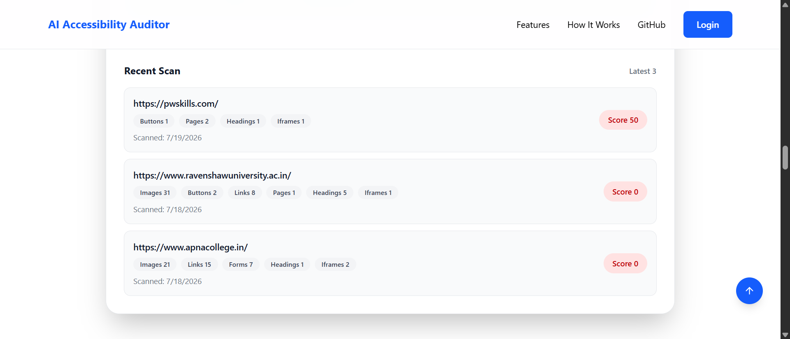

# AI Accessibility Auditor

AI Accessibility Auditor is a full-stack web application that scans websites for accessibility issues and provides structured reports with issue categories, severity levels, recommendations, and scan history.

The project helps developers identify common accessibility problems such as missing alt text, inaccessible buttons, unreadable links, unlabeled form fields, poor heading structure, missing iframe titles, and page-level metadata issues. **And there will be more to come!**

## Features

- Scan public website URLs
- Detect accessibility issues from website HTML
- Categorized issue tabs with counters
- Severity-based issue classification: HIGH, MEDIUM, LOW
- Dynamic accessibility score calculation
- Issue-specific recommendations
- Recent scan history
- Category badges for previous scans
- PostgreSQL database integration
- Responsive React frontend
- Spring Boot REST API backend

## Accessibility Checks

The scanner currently checks for:

- Images missing `alt` text
- Buttons without accessible text or `aria-label`
- Links without readable text or `aria-label`
- Form inputs without labels
- Missing or multiple `h1` headings
- Skipped heading levels
- Iframes without descriptive `title`
- Missing page title
- Missing HTML `lang` attribute
- Missing meta description
- *And there will be more to come!*

## Tech Stack

### Frontend

- React
- Vite
- Tailwind CSS
- Lucide React
- React Icons

### Backend

- Java 21
- Spring Boot
- Spring Web
- Spring Data JPA
- PostgreSQL
- Jsoup
- Maven

### Database

- PostgreSQL

## API Endpoints

### Health Check

```http
GET /api/health
```

Response:

```json
{
  "status": "UP",
  "message": "Backend running 🚀"
}
```

### Scan Website

```http
POST /api/scan
Content-type: application/json
```

Request:

```json
{
  "url": "https://example.com"
}
```
Response:

```json
{
  "url": "https://example.com",
  "accessibilityScore": 85,
  "totalIssues": 2,
  "issues": [
    {
      "type": "IMAGE",
      "severity": "MEDIUM",
      "message": "Image is missing alt text",
      "element": "/logo.png",
      "recommendation": "Add meaningful alt text to images so screen reader users can understand the visual content."
    }
  ],
  "scannedAt": "2026-07-18T10:30:00"
}
```

## Get All Scan History

```http
GET /api/scan/history
```

### Get Recent Scan History

```http
GET /api/scan/history/recent
```
> **Note:** _It returns the latest 3 scans records._

## How to Run Locally

### 1. Clone the repository
> _You can fork the repo, if you want 😶‍🌫️_

```Bash
git clone https://github.com/suryakanta-mohanty/ai-accessibility-auditor.git
cd ai-accessibility-auditor/
```

### 2. Run the Backend
Go to the backend folder:

```Bash
cd backend/
```

**Update `application.properties` with your PostgreSQL details:**
```properties
spring.datasource.url=jdbc:postgresql://localhost:5432/ai_accessibility_auditor
spring.datasource.username=postgres
spring.datasource.password=YOUR_PASSWORD

spring.jpa.hibernate.ddl-auto=update
spring.jpa.show-sql=true
spring.jpa.properties.hibernate.format_sql=true

server.port=8080
```

**Run the backend:**
```Bash
mvn spring-boot:run
```

*Backend will start at:*
```
http://localhost:8080
```

### 3. Run the Frontend
*Open a new terminal:*

**Switch to Frontend Folder:**
```Bash
cd frontend/
```

**Insatll Dependencies:**
```Bash
npm install
```

**Run the project locally:**
```Bash
npm run dev
```

**Frontend will start at:**
```
http://localhost:5173
```

## Current Limitations
- The scanner uses Jsoup, so it scans static HTML returned by the server.
- It does not execute JavaScript like a real browser.
- Dynamic content generated after page load may not always be detected.
- In future versions, there may be use of Playwright or Selenium for rendered DOM scanning.

## Future Improvements
- User authentication
- User specific scan history
- Detailed saved reports
- PDF report export
- AI-Powered improvement suggestions
- Advanced JavaScript rendered page scanning
- Dashboard with analytics
- WCAG rule mapping

## Screenshots

### Homepage



### Scan Repot



### Recent Scans



## Author
**Suryakanta Mohanty**

GitHub: [suryakanta-mohanty ↗](https://github.com/suryakanta-mohanty)
LinkedIn: [suryakanta-mohanty ↗](https://www.linkedin.com/in/suryakanta-mohanty/)

*Thank you 😀*